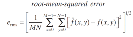

# 实验6，任务1
编程对图片bridge.bmp和web.bmp进行压缩
1.	采用哈夫曼编码，实现压缩和解压缩
2.	采用无损预测编码，并对误差进行哈夫曼编码，实现压缩和解压缩（该小题选做）
3.	用平均均方误差的平方根（如下），对解压缩后的图像和原图进行比较，并计算压缩比

**注意：压缩后的文件封装格式可以不被windows读出，但要能被你的解码函数读出，并在OpenCV编程环境中显示**

