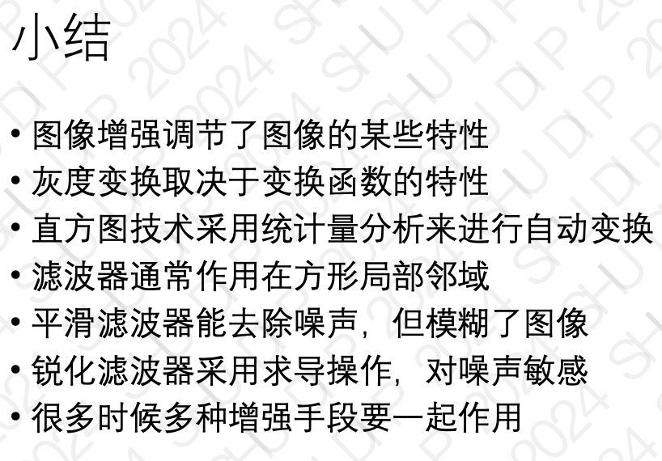
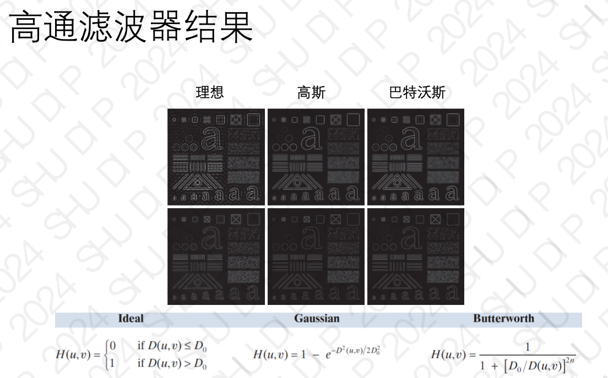

# 数字图形处理
> 引入表示疑似重点
## 第一讲、绪论
### 什么是数字图像
以数字形式进行存储和处理的图像

可以看做是一个二维矩阵

### 什么是数字图像处理
指采用计算设备对数字图像进行加工处理，使其满足视觉、心理以及其他要求的技术
#### 为什么需要图像处理技术
1. 采集图像不理想，需要增强
2. 图像显示、打印、存储及传输需要
3. 从图像中抽取有价值的信息

### 数字图像处理的起源
数组图像最早的应用之一是报纸业
### 成像源分类
> **最主要的成像源是电磁波**，其他的包括声波、超声波、电子

电磁波谱：按光子能量分组
- 伽马射线成像：核医学、天文观察
- X射线成像：最早用于成像的电磁辐射源之一
- 紫外线成像：用于荧光显微镜
> - 可见光及红外线成像：应用最多，**多波段遥感成像**
> - 微波成像：雷达
> - 无线电成像：磁共振成像MRI
### 图像处理的应用
### 图像处理的相关学科
### 图像技术三层次
> 疑似重点
#### 低层Low-Level
- 对图像的预处理：去除噪声、对比度增强和图像锐化等
- 输入输出都是图像
#### 中层Middle-Level
- 图像分割
- 提取分割后目标的特征
- 输入图片，输出特征(边缘、轮廓、直方图)
#### 高层High-Level
- 对目标进行分类或识别
- 对场景中发生事情进行理解
#### 总结：图像处理-图像分析-图像理解

## 第二讲、数字图像基础
### 人的视觉感知
······
#### 亮度适应
人眼的亮度适应范围大，
主观亮度与光强的对数值有关系

**亮度适应现象： 暗->亮：快； 反之则慢**
#### 同时对比效应
由于人眼对亮度有适应性，很难精确判断刺激的绝对亮度，相同的亮度刺激，由于其背景亮度不同，人眼所感知的主管亮度是不同的
#### 马赫带效应
人感觉到的在亮度变化部位附近的暗区和亮区中分别存在更黑和更亮的条带

### 图像感知与获取
#### 图像的生成
> 生成 照射 接收

图像是由照射源和场景元素
对光的的反射或透射而产生
（照射源：电磁波，场景元素：常见物体，反射：平面反射，透射：X光成像）
#### 图像传感器
- 单个成像传感器（如光二极管）
- 线传感器（扫描仪、遥感）
- 传感器阵列（CCD）
> CCD捕获 取代胶片
### 图像取样和量化
> 离散化
- 将空间上的连续画面转化成离散取样点
- x、y方向上进行
- 图像分辨率由CCD和取样过程决定
- 单位：像素
#### 取样尺寸对画质的影响
画阵相机，CCD尺寸越大，取样率越高，分辨率越高
#### 量化
CCD感应值数字化称为量化
- 量化的级数位：灰度级
- 取数为2的整数幂
#### 量化级数对画质的影响
量化级数减少时，灰度级别也减少
1. 灰度过渡的平滑性：高量化级数可以更细致地描述亮度变化，使白到黑的过渡更加平滑；而低量化级数会造成灰度值间的跳跃，导致图像中出现“条带效应”（Banding），即不连续的灰度分区，视觉上有明显的分层感，画质下降。

2. 图像细节的损失：低量化级数无法准确描述图像的细微细节，例如阴影和渐变区域会显得生硬、缺乏层次，导致图像失真，难以真实反映原始内容。
> 量化级数越高，精度越高
### 数字图像表示
> 灰度图像：单通道 二维矩阵，只有亮度没有颜色

彩色图像：三通道二维矩阵
### 图像基本数学运算
> 这块疑似重点
#### 基本运算
加：
1. 去燥 **时域平均：对加性白噪音**
2. 图像合成

减：
1. 蓝绿幕
2. 图像比较
3. 运动目标提取

乘：
1. 图像区域（ROI）（mask）

除：
1. **矫正光照**
2. 阴影除去

#### 规范化
超出范围的矫正回（0，255）
- 直接截断法
- 线性规范法

#### 图像几何变换
空间变换，旋转，缩放

新像素点赋值问题：
- 最近邻插值
- 双线性插值 （效果更好,更柔和）


``` python
# 遍历目标图像，插值
new = np.zeros((new_h, new_w, 3), dtype=np.uint8)
for n in range(3):  # 3个通道的循环
    for dst_y in range(new_h):  
        for dst_x in range(new_w):  
            # 计算目标像素在原图片上的像素的坐标
            # Tips：原本应该是目标像素坐标 = 原像素坐标 * scale缩放因子
            # 但像素坐标是像素左上角，像素中心应该有0.5的偏移值 所以在乘缩放因子前后都要调整这个中心位置
            org_x = (dst_x + 0.5) / scale - 0.5
            org_y = (dst_y + 0.5) / scale - 0.5

            # 计算在源图上的左上角和右上角的x/y值
            # eg：(org_x_0, org_y_0)是左上角，(org_x_1, org_y_1)是右下角
            org_x_0 = int(np.floor(org_x))  # floor是下取整
            org_y_0 = int(np.floor(org_y))
            org_x_1 = min(org_x_0 + 1, org_w - 1)
            org_y_1 = min(org_y_0 + 1, org_h - 1)

            # 双线性插值
            # Tips：相减的距离作为衡量的权重
            # 对Y = org_y_0 这一行（上面的一行）做 X方向线性插值  选取的两个点：左上角 右上角
            value0 = (org_x_1 - org_x) * org[org_y_0, org_x_0, n] + (org_x - org_x_0) * org[org_y_0, org_x_1, n]
            # 对Y = org_y_1 这一行（上面的一行）做 X方向线性插值  选取的两个点：左下角 右下角
            value1 = (org_x_1 - org_x) * org[org_y_1, org_x_0, n] + (org_x - org_x_0) * org[org_y_1, org_x_1, n]
            # 对得到的value0 value1 做 Y方向的线性插值 这里的权重是上面和下面那一行的y值与此点的y值的距离来衡量
            new[dst_y, dst_x, n] = int((org_y_1 - org_y) * value0 + (org_y - org_y_0) * value1)

            # 此时这一个像素点已经计算得到它应该的值 继续循环 得到最后的图片

return new
```
- 双三次
- 图像超分辨率：基于学习的插值
- 图像配准


- 几何变换估计：仿射变换，至少三对点来确定，最小二乘法

### 常见图像文件格式
#### BMP
标准位图文件格式，占用空间很大
#### GIF
支持LZW算法压缩在50%，适合少量独特色彩风格的图形和动画
>#### JPG
>利用人类视觉特点达到高压缩率，可以按照图像质量来选择压缩率
#### PNG
便携网络图像格式，文本表现优异，深度48位，可以控制透明度
## 第三讲、灰度变换与空间滤波
### 图像增强概述
主要目的：处理衣服图像使其结果对特定应用更合用

#### 空域增强方法
空域：图像的二维坐标平面

灰度图像：表示该位置的亮度值。0，255  0是纯黑

空域算子：T是邻域关于灰度值算子
### 灰度变换
邻域1*1，T退化为一个单点变换函数
>#### 图像反转
> $$s = 255 - r$$

增大大片黑色区域中白色或灰色细节

>#### 幂变换：伽马变换
>$$ s = C \cdot r^\gamma $$
- 像素事先归一化到[0,1]
- $ \gamma $ < 1,扩展低灰度范围,整体变亮
- $ \gamma $ > 1,扩展高灰度范围,对比度越高
- 显示过程不是1:1关系
- 输出之前先对图像进行相反的伽马矫正

#### 分段线性变换
- 分段线性函数：优点可以任意复杂
- 可用于对比度拉伸：提升灰度级的动态范围
- 对比度低的形成原因：
    - 光照不足
    - 光圈设置错误
    - CCD动态范围小
> - 查找表LUT：针对 $ s = T (r) $,构造 256 的映射表

### 直方图技术
像素亮度（灰度级）是随机变量，分布具有统计特性
 
灰度直方图是灰度级的统计函数，反映图像中每个灰度级出现频率

归一化直方图：频率到概率，除以总像素点个数

> **高对比度图像特点：直方图分布均匀**
### 直方图均衡化
自实现原理和过程：
1. 计算累积分布函数（CDF）：
CDF 是对频率分布函数（PDF）的积分，它表示每个像素值在原始图像中出现的概率。CDF 可以通过对 PDF 进行累加计算得到
2. 构建新的灰度级映射函数：
$Sk = (L - 1) * C(rk)$ , rk 为某个像素值，Sk是新的灰度值，范围仍在 $[0,L−1] $之间
该公式表示累积分布函数的归一化映射，将原始图像的灰度值范围拉伸至整个灰度级范围。
``` python
def my_equalizeHist(src):
    # 第一步 计算直方图
    # bins：表示直方图的区间数，range：定义直方图的范围
    # 返回值：hist--每个元素表示对应区间中的像素数量；bins--长度为（bins + 1），表示每个区间的边界值
    hist, bins = np.histogram(src.flatten(), 256, [0, 256])

    # 第二步 计算累积分布函数 (CDF)
    cdf = hist.cumsum()  # 累加和

    # 第三步：将 CDF 归一化到范围 [0, 255]
    cdf_min = cdf.min()  # 找到 CDF 中的最小非零值，避免除以零的情况
    cdf_max = cdf.max()
    cdf_normalized = ((cdf - cdf_min) * 255 / (cdf_max - cdf_min)).astype('uint8')  # 归一化，并确保灰度级是整型
    # cdf_normalized = (cdf * hist.max() / cdf.max())   # 对 CDF 进行归一化,

    return cdf_normalized[src]  # 返回归一化后的cdf图像
```
> 简单来说：概率-累计分布函数-变换后映射
- 计算图像的灰度直方图： 画一个图表，告诉我们每个亮度值有多少个像素。
- 计算累计分布函数（CDF）： 累加每个灰度级别的频率，得到从0到当前灰度级别的所有像素总和。通过它，我们知道一个灰度值以下的所有像素的数量。
- 归一化CDF： 表示了每个灰度值在图像中出现的“相对频率”。
- （取整）计算新的灰度值： 通过归一化的CDF，我们可以得到每个像素的新灰度值。

### 空域滤波
图像噪声：
- 高斯噪声：照度低，CCD发热
- 椒盐噪声：传输问题，CCD和镜头污点，电磁干扰

怎么去躁：
- 时域平均
    - 采集多幅图像后相加求平均
    - 对于加性白噪声尤其有效
- 时域 = 空域

> 流程：
> - 选择滤波器：卷积核kelnel大小（3*3）
> - 每个像素进行滤波后替换原像素

#### 平值滤波器
均值滤波器：mask越大去躁能力加大，越平滑
- 负面效果：到值遍阅模糊，可遍历性在亮度一致的区域菜满足

高斯滤波器：权值体现远近像素点不同影响，离中心越近权值越高
- 高斯核更平滑

双边滤波

平滑滤波器其他作用：过滤细节，提取主干
> 中值滤波：椒盐噪声很好用

#### 锐化滤波器
突出灰度变化部分，增加细节，可能引入噪声，帮助提取目标边界，用于图像分割、特征提取

> - 边缘检测：求导
> - 导数变差分
> - 一阶导梯度算子：粗糙边缘

二阶导数：拉普拉斯算子 最简单的二阶微分算子

**图像锐化思路**：强化细节，将原始图像和算子输出叠加

一阶导数的应用：
- sobel噪声抑制更佳
- 非线性方法
- 构成一幅梯度图像：提取图像边缘，只包含灰度变化大的地方

基于梯度的图像增强：检测瑕疵，避免背景干扰

**噪声对图像求导影响大**

混合空间增强法：
例如--一阶导调整二阶导结果 更平滑


## 第四讲、频率域滤波
### 图像的频域
> 频域滤波概念  频域是啥，增强图像

**频域：坐标为频域**
- **低频：主体**
- **高频：细节**

为什么在频域中增强图像
- 人类视觉易于感受的是空间域
- 有些在空域中不好处理的问题，在频域中却**很容易处理**

应用
- 图像增强：低通滤波，高通滤波
- 图像压缩：正交变换、DCT
- 提取图像特征：直流分量，目标物边缘

### 傅立叶变换
> 傅立叶变换：了解思想
任何周期函数可表示为不同频率的三角函数的加权之和

任意信号分解为三角函数的组合
### 图像傅立叶变换
图像由不同频率的二维三角函数构成

傅立叶反变化可以完全重建图像

**JPEG压缩核心：保存傅立叶变换后的系数，丢弃人眼不可查的高频系数可极大压缩**
> 反变换压缩

### 频域滤波原理


### 常用滤波器
#### 低通滤波器
> 低通 平滑

常见的低通：
理想滤波器、巴特沃思滤波器、高斯滤波

应用：文字识别美化修复，美化图片
#### 高通滤波器
> 高通 边缘提取

低通反操作得到



应用：用于指纹图像的增强
#### 选择滤波器
> 选通：带通（某些通过） 带阻（某些阻止） 陷波（精准去除 狭窄）

## 第五讲、彩色图像处理
### （前面几小结了解）
单频光颜色由波长决定

光谱：反映光的各频率能量分布

反射光决定物体颜色

异谱同色：两束混合光，光谱不一样，人眼相同色

人眼：锥状细胞感应颜色

数字相机感光元件：CCD

我的妈呀这个DIP 我要晕掉了


>RGB、CMY、HSV 用来干嘛啥意思
### RGB用于显示 
加色模型
### CMY模型用于印刷 
减色模型

颜料就是白光中减去某种颜色

印刷三原色：
- C吸红光
- M吸绿光
- Y吸蓝光

添加黑色

### 面向感知：HSV
H：色调
S：饱和度
V：亮度

### 彩色图像增强
彩色变换

和灰度图像类似 $g(x, y) = T[f(x, y)]$

互补色、对比色
- 补色 = (255,255,255) - 颜色
- 互补色混合Chans灰度色

可用于增强暗色彩区域细节

#### 亮度矫正
提升彩色图像亮度对比度

通常以交互式进行

在合适亮度范围看到更多细节

#### 颜色平衡
人对肤色感知力很高

调节一个分量

#### 直方图均衡化
RGB会失真

HSV 中 I(V)分量做 再合成 比较ok

亮度调整对颜色感知有影响：先调整一下饱和度，再进行亮度变换

#### 彩色图像平滑
RGB分别进行均值滤波平滑

HSI中单独对I

**锐化与平滑同理**

### 伪彩色图像增强
原理：灰度图像按照灰度值分成若干区间，每个区间赋予一种颜色，类似于查表法

示例：用颜色突出降雨水平

## 第六讲、图像压缩技术
图像压缩：降低所需存储资源，传输时减少网络带宽

通过对原始采集的图像进行编码以减少数据量

#### 图像压缩率
m：原平均码长 (灰度8b，彩色24b)  
n：现平均码长

$$C_{\text{R}} = \frac{m}{n}$$

#### 压缩类型
- 信息保存型
- 信息损失型

#### 图像压缩可行性
> 图像原始存储方式存在冗余

冗余类型
> 三种冗余类型啥意思

- 编码冗余
    - 图像编码是表示图像信息的符号系统 
    - 指所选符号系统效率不高
- 像素相关冗余
    - 像素之间是存在相关性的 
    - 无视相关性带来的数据重复
- 心理视觉冗余
    - 人对有些视觉信息并不敏感
    - 在不削弱图像视觉感知的情况下可以去除
    - 通常是有损压缩
### 图像信息衡量：信息论
> 信息量与熵

香农：信息论奠基人

发生概率为 $P(E)$ 的随机事件 $E$ \的信息量（通常使用香农信息量公式表示）:

$$ I(E) = \frac{1}{\log_2 P(E)} = - \log_2 \left( \frac{1}{P(E)} \right)$$
**事情发生越频繁，信息量越少**

信源的平均信息量称为**熵**：
$$H(X) = - \sum_{i} P(x_i) \log_2 P(x_i)$$
香农第一定律：
>- 熵给定了无损描述一个信源所需的平均码长最小值
- 熵反映了信源的不确定性
#### 保真度准则
- 无损压缩可以完全保真
- 有损压缩存在损失，需衡量损失程度
- 客观保真度准则
    - 差值
    - 均方误差
    - 峰值信噪比
- 主观保真度准则：使用人的主观评估衡量

### 变长编码
属于统计编码、无损压缩  

利用像素值的概率分布：
- 出现概率大的用短码长
- 减少编码冗余

**熵编码**：编码平均码长接近熵

#### Huffman编码
> 流程 实验6 final.py


### 预测编码
> 预测图像 熵减小 码长短
- 去除图像中的相关冗余
    - 用邻近像素来预测当前像素
    - 对预测误差进行编码
        - 如哈夫曼编码
- 出发点
    - 误差值的不确定性要小于原始图像
    - 熵比原图像小，码长更短

### 变换编码
> 变换编码 JPEG：保留低频系数，人眼看不见

将图片经过变换（如变换到频域）得到系数   
对系数进行量化（约简）后再编码

变换方法：傅立叶变换、离散余弦变换DCT、小波变换

非信息保持型（有损压缩）
**当前主流编码方式**

#### DCT
YCbCr   
Y：亮度
Cb：蓝色色度
Cr：红色色度

对色度通道降采样
- 人类视觉对亮度辩护比色度敏感
- 对色度降采样来降低数据量

**基于DCT的变换编码：**

- 颜色转换到YCbCr空间，做色度抽样
- 构造子图像（分成小块，如8*8）
- DCT变换
- 量化：DCT系数除以量化矩阵再取整
- 符号编码：游程编码、huffman编码

解码流程是逆向操作，除了量化

### 视频压缩
> 把空间冗余去掉

相邻帧相关性强，时域冗余信息很多    
时域预测比空域预测效率高很多

帧间预测不一定有效：近邻画面变换大时效果变差

图像分块：帧间预测全图通模型预测误差大，将画面分为互不重叠的子块

运动补偿：在参考帧中寻找每个宏块的最佳匹配

### 图像压缩国际标准
......

## 第八讲 图像分割
> 三种方法必须会一个

>区域生长思想

### 基于阈值 
选择一个阈值T。

将图像中所有像素与阈值T进行比较：
- 如果像素值大于T，就将其归为一类（例如前景）。
- 如果像素值小于或等于T，就将其归为另一类（例如背景）。

这样图像就被分成了两个区域：背景区域和目标区域。

图像噪声对阈值方法对影响，可以对噪声先进行平滑


### 基于边缘   
依赖于图像中强烈变化的区域，即边缘

边界上存在不连续性，像素值变化较大

一阶差分，二阶差分

**原图->梯度值->阈值化->边缘图**


### 基于区域
#### 区域生长   
边缘不适用时

从区域一致性出发   
> 基本思想：
>- 事先定义相似性准则
>- 满足准则的子区域聚合成更大区域

相似性可以定义在特征上


#### 分裂聚合


## 第九讲 图像特征
> 类型    
> 链码：描述轮廓   
> 统计：纹理   
> 共生矩阵

目的：对图像进行紧凑和有效地描述
- 从图像到数值或向量的变换
- 效率提高，处理速度更快
- 加入主观认识，抓住目标本质

>**类型**:
>- **灰度/颜色：直方图**
>- 形状： 边缘，轮廓
>- 频域： 傅立叶变换
>- 特征点：角点 SIFT


**形状描述：链码**


**纹理：**


## 第七讲 形态学图像处理（dgt没讲）
> 了解 腐蚀膨胀

> 邻域有哪些

> 4 - 邻接 怎么形成   
位置，像素值本身   
和 8 - 邻接的区别

形态学：提取和表达图像中区域的形状


